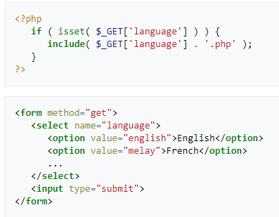
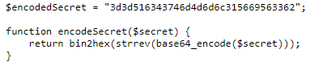
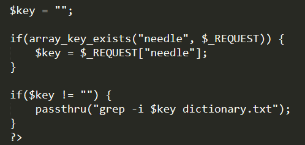

## natas traning

* **1->2**
>* http://natas1.natas.labs.overthewire.org
>* press key F12 to open the inspect
>* ZluruAthQk7Q2MqmDeTiUij2ZvWy2mBi
* **2->3**
>* http://natas2.natas.labs.overthewire.org/
>* /files/pixel.png loking for this page
>* /files the code
>* natas3:sJIJNW6ucpu6HPZ1ZAchaDtwd7oGrD14

* **3->4**
>* http://natas3.natas.labs.overthewire.org/
> *  http://natas3.natas.labs.overthewire.org/Robots.txt
> robots.txt is a txt file with all the files that are not accesible from search engins
> it usualy contains file that the ownwer dose not want to show it culled include password scripts etr
> * /s3cr3t/
>* natas4:Z9tkRkWmpt9Qr7XrR5jWRkgOU901swEZ

* **4->5**
> * look  CommonPhpFiles.txt
>* HTTP referer  is an HTTP header field that identifies the address of the webpage (i.e. the URI or IRI) that linked to the resource being requested. By checking the referrer, the new webpage can see where the request originated.
>* Referer logging is used to allow websites and web servers to identify where people are visiting them from, for promotional or statistical purposes
>* The default behaviour of referer leaking puts websites at risk of privacy and security breaches
>* Most web servers maintain logs of all traffic, and record the HTTP referrer sent by the web browser for each request. This raises a number of privacy concerns, and as a result, a number of systems to prevent web servers being sent the real referring URL have been developed. These systems work either by blanking the referrer field or by replacing it with inaccurate data. Generally, Internet-security suites blank the referrer data, while web-based servers replace it with a false URL, usually their own. This raises the problem of referrer spam. The technical details of both methods are fairly consistent  – software applications act as a proxy server and manipulate the HTTP request, while web-based methods load websites within frames, causing the web browser to send a referrer URL of their website address. Some web browsers give their users the option to turn off referrer fields in the request header
> * If a website is accessed from a HTTP Secure (HTTPS) connection and a link points to anywhere except another secure location, then the referrer field is not sent
>* crome extention tamper
>* change http://natas4.natas.labs.overthewire.org/index.php to http://natas5.natas.labs.overthewire.org
>* iX6IOfmpN7AYOQGPwtn3fXpbaJVJcHfq

* **5->6**
> * Well, let’s trick the server into believing we’re logged in. Let’s see what Fiddler reveals in the server response body.
> * HTTP/1.1 200 OK
Date: Thu, 27 Oct 2016 21:18:31 GMT
Server: Apache/2.4.7 (Ubuntu)
X-Powered-By: PHP/5.5.9-1ubuntu4.20
Set-Cookie: **loggedin=0**
Vary: Accept-Encoding
Content-Length: 855
Keep-Alive: timeout=5, max=100
Connection: Keep-Alive
Content-Type: text/html
> *  changing cookes to logedin
> * aGoY4q2Dc6MgDq4oL4YtoKtyAg9PeHa1

* **6->7**
> * klicked inspect element
> * found index-source.html
> * gone http://natas6.natas.labs.overthewire.org/index-source.html
> * found includes/secret.inc
> * gone
> * found FOEIUWGHFEEUHOFUOIU
> * natas7: 7z3hEENjQtflzgnT29q7wAvMNfZdh0i9

* **7->8**
>*  hint: password for webuser natas8 is in /etc/natas_webpass/natas8
>* nothing http://natas7.natas.labs.overthewire.org/etc/natas_webpass/natas8
>* http://natas7.natas.labs.overthewire.org/index.php?page=home/etc/natas_webpass/natas8 ---> two errors
>* Warning: include(home/etc/natas_webpass/natas8): failed to open stream: No such file or directory in /var/www/natas/natas7/index.php on line 21

>* Warning: include(): Failed opening 'home/etc/natas_webpass/natas8' for inclusion (include_path='.:/usr/share/php:/usr/share/pear') in /var/www/natas/natas7/index.php on line 21
> * EXPLANATION
The links tell us a little about how index.php works.  The comment tells up the exact path of where the password is stored.  Before we go looking for that password, lets try to discover how this website works.  We notice when we click on different links, index.php will serve us a different page.  We see in the URL “index.php?page=[$PAGE]” with $PAGE being a variable I just made up representing any value.  From this we can infer that there are pages named “home” and “about” which contain the HTML we see when we click on any of the links.  Lets tamper with the URL by throwing a bunch of junk after the ?page=. This causes an error in the PHP application, because the file we tried to reference does not actually exist.
 > * File inclusion vulnerability <--- read
 > ##  IN SHORT
 > * the http://natas7.natas.labs.overthewire.org/index.php?page=home
 is a php vulnerability . the page is actualy a variable  that resives
 value in order to determin in which page to go in our case home and About BUT we can just put whatever value we want for example the hint url link
> 
 > * natas8 DBfUBfqQG69KvJvJ1iAbMoIpwSNQ9bWe
 > * Testing for Local File Inclusion <---read

 * **8->9**
 >*found  $encodedSecret = "3d3d516343746d4d6d6c315669563362"; in http://natas8.natas.labs.overthewire.org/index-source.html
 > * * note the source code of the above in all added togather
 > mind 
 > * decripted code -->oubWYf2kBq
> * key natas9 (flag) W0mMhUcRRnG8dcghE4qvk3JA9lGt8nDl

 * **9->10**
> *view-source:http://natas9.natas.labs.overthewire.org/dictionary.txt from sorce code
> *  
> * So from the top down:
A variable named $key: this variable is initialized to a blank string.
An if statement that looks for a variable in the request named “needle”, and applies the value to the “key” variable.
And if statement that performs an action if the key is not an empty string.
the Passthrough function is called.
Lets run a quick test. In the search box, search for “test”. In the address bar of our web browser, we should now see: http://natas9.natas.labs.overthewire.org/?needle=test&submit=Search
> * The passthru() function is similar to the exec() function in that it executes a command. This function should be used in place of exec() or system() when the output from the Unix command is binary data which needs to be passed directly back to the browser. A common use for this is to execute something like the pbmplus utilities that can output an image stream directly. By setting the Content-type to image/gif and then calling a pbmplus program to output a gif, you can create PHP scripts that output images directly.

> * its just like having a shell u can run normal windows commands after ;
> * ls -l -----> -rw-r----- 1 natas9 natas9 460878 Dec 15  2016 dictionary.txt
> *test; ls ../../../../etc/natas_webpass

> *;cat ../../../../etc/natas_webpass/natas10
>* natas10 nOpp1igQAkUzaI1GUUjzn1bFVj7xCNzu

 * **10-->11**
 > * n/?needle=.*&submit=Search
 > * .*
 > natas11:U82q5TCMMQ9xuFoI3dYX61s7OZD9JKoK
 > https://hackmethod.com/overthewire-natas-10/

## **11-12**
>
>
